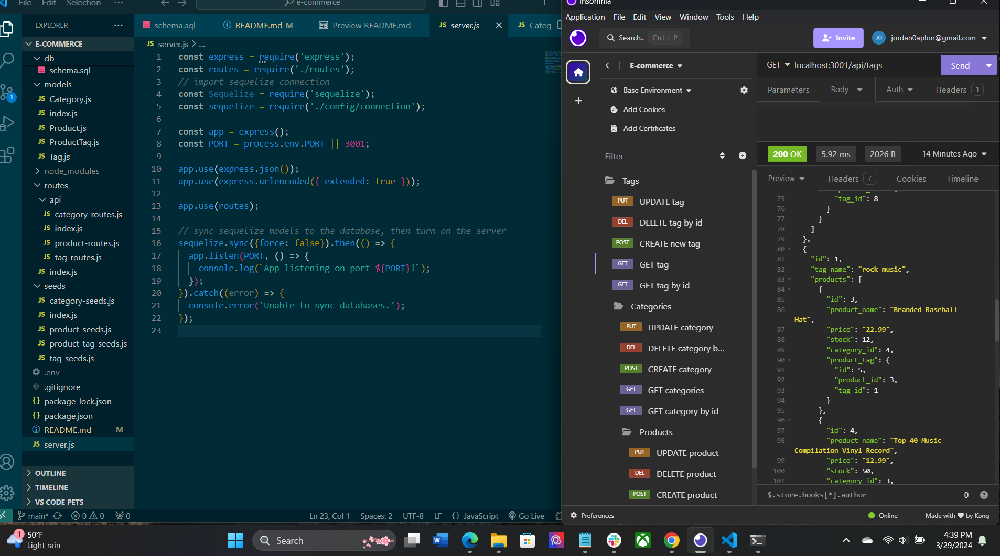

# E-Commerce
 
  

## Description

This application lets you add products to a online goods store. You can look through a database that has the product name, price, how many items are in stock, and what category of goods it's in. You can also create new goods, delete them, or update them.

Walkthrough Video: [click me!](https://drive.google.com/file/d/1GVNppLFYZJ6ZPCgcZXNisYfSNKSDUE63/view)

## Table of Contents

- [Description](#description)
- [Installation](#installation)
- [Usage](#usage)
- [License](#license)
- [Contributing](#contributing)
- [Tests](#tests)
- [Questions](#questions)

## Installation

You need to install the express package, the pg package, dotenv, and sequelize.

## Usage

To use this application you need to seed you database by opening the postgres terminal and creating a table. Then in the server.js terminal you need to run npm run seed. This command should connect your database. Then run node serverr.js to open the port connection. You should now be able to test your routes.

## License

This project is licensed under the MIT license.
## Contributing

N/A

## Tests

All tests were run using Insomnia.

## Questions

For questions or feedback regarding this project, please contact me at JoAplon, through my [github](https://github.com/undefined), or my email, jordan0aplon@gmail.com.

